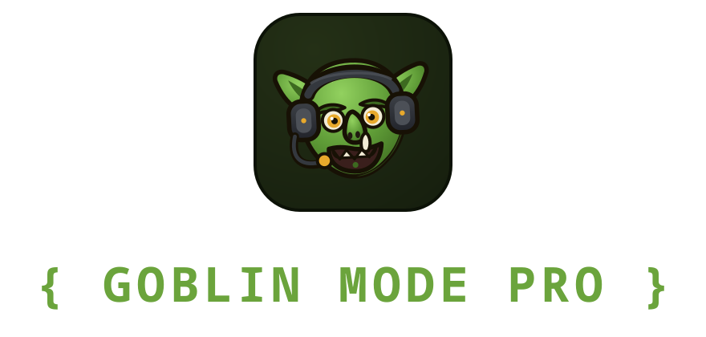
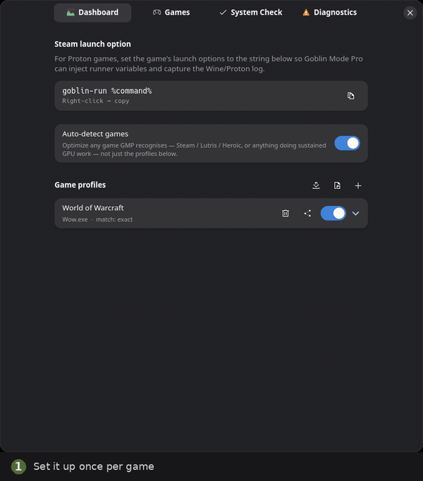
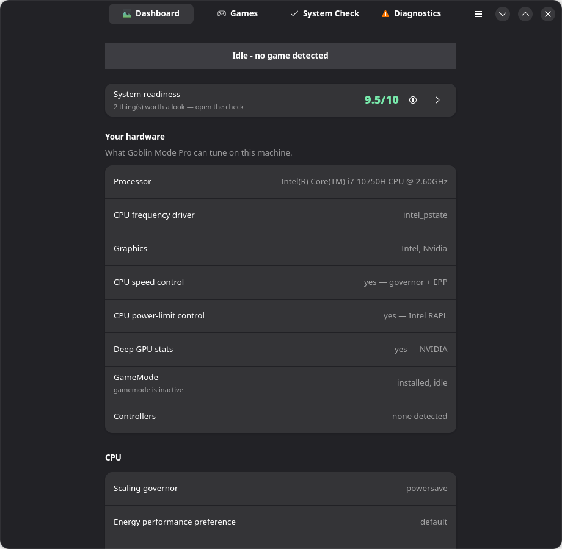
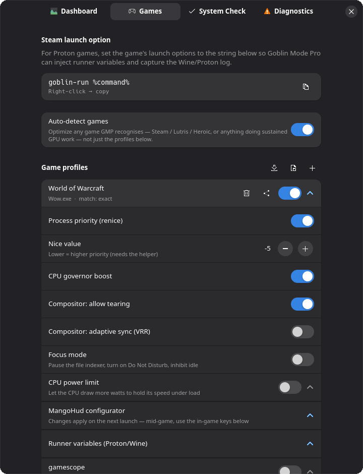
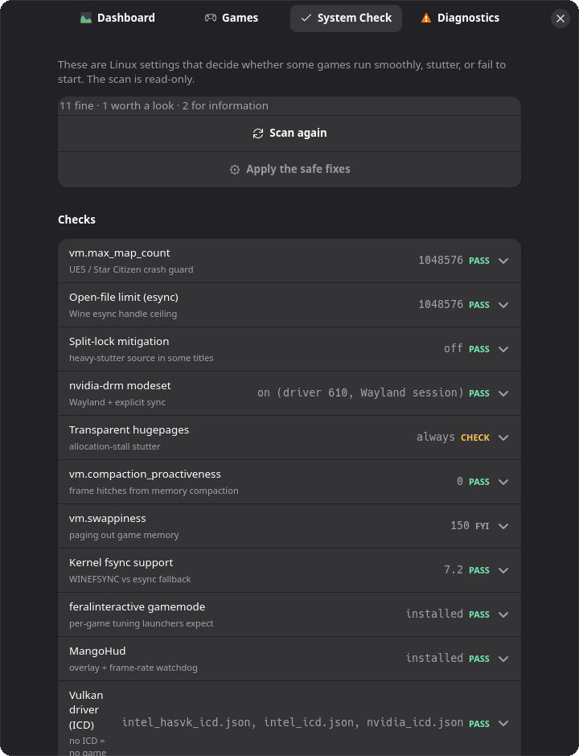
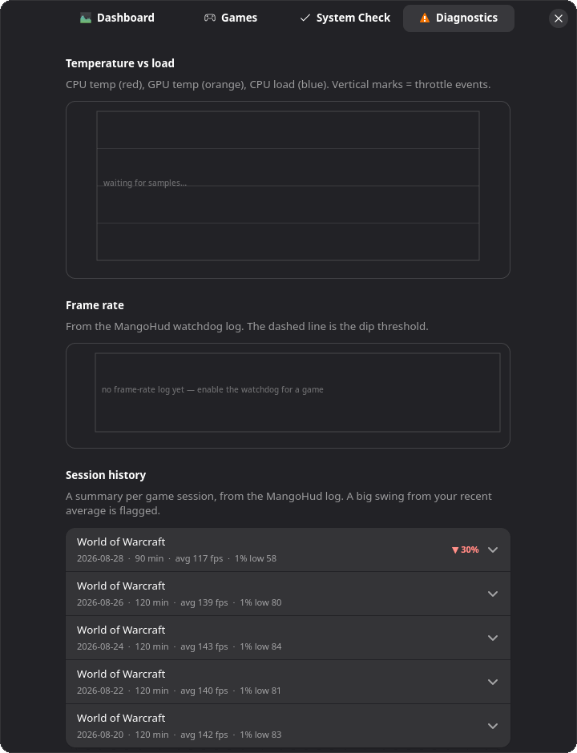

<div align="center">



# Goblin Mode Pro

### A one-switch performance helper for Linux gaming.

Goblin Mode Pro notices when a game starts, flips your system settings to their
"I'm gaming now" positions, and puts every one of them back the moment you quit —
then watches the temps, frame rate and Proton log and tells you, in plain
language, why something broke.

**MangoHud shows you the numbers; Mission Center shows you the system. Goblin
Mode Pro *acts* on both** — it changes the CPU governor, process priority,
compositor and power limits automatically per game and reverts them cleanly,
and when your FPS falls off a cliff it captures the GPU state and names the
cause. It's the missing piece between "I can see the problem" and "it's fixed."


**[Documentation](https://bvaughan7.github.io/goblin-mode-pro/)** · [Getting started](https://bvaughan7.github.io/goblin-mode-pro/getting-started/) · [Command line](https://bvaughan7.github.io/goblin-mode-pro/cli/) · [Troubleshooting](https://bvaughan7.github.io/goblin-mode-pro/troubleshooting/)



<sub><i>Set it up per game → check the system is ready → a game launches and the CPU locks to <code>performance</code> → Diagnostics catches the temp climb and a −30% 1%-low regression → the game exits and everything reverts and cools.</i></sub>

</div>

---

<div align="center">

| | |
|---|---|
|  |  |
| **Dashboard** — what your machine can be tuned for, plus live CPU/GPU stats | **Games** — per-game switches, in plain language |
|  |  |
| **System Check** — the kernel settings that make Linux games crash or stutter | **Diagnostics** — temp/FPS history, crash-log analysis, one-click report |

</div>

---

## What it actually does to boost your FPS

Linux ships with sensible **defaults for a laptop on battery**, not for a game
that wants every drop of performance. Goblin Mode Pro changes the settings below
while a game is running and reverts them afterwards. In plain terms:

| Setting | What Linux does by default | What Goblin Mode Pro does | Why it helps |
|---|---|---|---|
| **CPU speed ("governor")** | Slows the CPU down whenever it thinks you're idle, to save power | Locks it at full speed while you play | Stops the stutter that happens when the CPU "wakes up" a beat too late |
| **Game priority ("renice")** | Treats your game the same as every background task | Tells the scheduler your game comes first | Background jobs (updates, indexing, browser tabs) stop stealing CPU mid-fight |
| **Energy hint ("EPP")** | Leans toward efficiency | Leans toward performance | The CPU stops second-guessing itself and holds higher clocks |
| **Screen tearing** | Adds a small delay so the picture is always "clean" | Allows tearing while you game | Lower input lag — your mouse feels more connected |
| **Adaptive sync / VRR** | Often left off | Turns it on for monitors that support it | The monitor matches the game's frame rate, killing a whole class of stutter |
| **CPU power limit / TDP** | Caps the watts the CPU may draw | Optionally raises the cap — a slider with 15/25/35/45 W presets. Intel via RAPL; AMD laptops via `ryzenadj` (experimental) | If your cooling can keep up, the CPU holds its top speed for longer |
| **CPU scheduler** *(`sched_ext`, opt-in)* | The kernel's default scheduler, tuned for everything at once | Optionally swaps in a `sched_ext` scheduler built for games (`scx_lavd`, `scx_bpfland`, …) for the duration of a game, and puts back exactly what you had | The scheduler stops treating your game like a background batch job |
| **Core pinning** *(hybrid / chiplet CPUs)* | Threads run on any core | Optionally pins the game to the fast cores (Intel P-cores) or one CCD (Ryzen) | Keeps the game off the slow cores and the cross-CCD latency hop |
| **Focus mode** | Indexer, notifications and screen-blanking all keep running | Pauses the file indexer, turns on Do Not Disturb, stops the screen sleeping | Removes the background hitches and the "screen dimmed mid-cutscene" problem |
| **Proton/Wine switches** | Off unless you set them by hand | Flips the common ones (NVAPI, Fsync, async shaders) per game | The settings most Windows games need on Proton, without editing launch options |
| **GPU driver tuning** | Off unless you set them by hand | Per-game presets — NVIDIA (`__GL_THREADED_OPTIMIZATIONS`, unlimited shader cache, forced G-SYNC) and AMD/RADV (`mesa_glthread`, `RADV_PERFTEST=gpl,nggc,rt`). Only the toggles for *your* GPU are shown | The driver knobs the community reaches for, without hand-editing launch options |
| **Undervolt re-apply** *(Intel, opt-in)* | Suspend / `thermald` can silently reset your undervolt mid-session | Re-runs `intel-undervolt apply` when the game starts — **never picks the values**, only re-applies the ones you set in `/etc/intel-undervolt.conf` | Your undervolt actually stays on |
| **Curve Optimizer re-apply** *(AMD, `ryzenadj`, opt-in, experimental)* | Same problem as above, on AMD | Re-applies the offsets from `/etc/goblin-mode-pro/amd-undervolt.conf` — **never picks the values**, same rule as the Intel path. Behind an "I understand the risk" confirm. **Experimental** — unverified on real AMD hardware | Your undervolt actually stays on |
| **Refresh-rate cap** *(internal panel)* | Fixed at your panel's max | Optionally caps it per game (Deck 40/50/60, Ally up to 120…) | Trade smoothness for battery life on a per-game basis |
| **Fan spin-up** *(opt-in, where the EC allows it)* | Reacts to heat after the fact | Forces fans to a high duty cycle on launch, reverts on exit. Verified on a Dell G7; most laptops let the EC own the fan curve, so this does nothing there — `selftest` tells you which you have | Gets ahead of thermal throttling instead of catching up to it |
| **MangoHud overlay** | Not shown | Shows FPS / temps on screen if you want it | See what's actually happening |
| **gamescope** *(optional)* | Not used | Runs the game inside gamescope, or launch a whole standalone gamescope session (`goblin-mode-pro-cli gamescope-session`, or the app-menu entry) | Rock-solid FPS cap, FSR/NIS upscaling, and alt-tab that doesn't break the game |

"Global" changes (CPU speed, tearing) are shared — they switch on when the first
game starts and switch off only when the last one quits.

### How this relates to what you already have

If you're on CachyOS, Nobara or a similar setup, some of the tuning above is
already handled. Goblin Mode Pro is built to sit *alongside* that stack, not
replace it — and the half it doesn't overlap with is the point.

| You already have | It covers | Goblin adds |
|---|---|---|
| **Feral GameMode** | governor + GPU perf level + `ioprio`/`nice` for the duration of a game | per-game (not global) profiles, compositor tearing/VRR, TDP, core-pinning, undervolt re-apply, focus mode — and it wraps `gamemoderun` itself unless you turn that off |
| **CachyOS `scx_loader` / `scxctl`** | loads a `sched_ext` scheduler system-wide, until you change it | the same schedulers, but *per game* and reverted on exit — it records what you had running and puts that back, so your own choice survives |
| **`ananicy-cpp`** (CachyOS default) | niceness / ionice / sched policy by rules | the System Check warns when it and GameMode and Goblin's `renice` would stack; new profiles start with `renice` off while it's running |
| **CachyOS `game-performance`** | governor + the distro's `scx` gaming scheduler on launch | everything in the table above, and it now switches schedulers too — per game rather than per session, and it restores whatever was running before |
| **MangoHud** | shows FPS / frametime / temps | the frame-rate watchdog that snapshots GPU state on a dip and names the cause, benchmark regression tracking across sessions, the Proton log analyzer, the System Check |

### And while you play, it watches for problems

- **System health score** — the System Check rolled up into one traffic-light
  number on the Dashboard ("your system is 9/10 game-ready"), with the failing
  items one click away. The first-run wizard shows it too and offers to apply the
  safe fixes on the spot.
- **System Check** — a one-page scan of the kernel settings that make Linux games
  crash or stutter (the infamous `vm.max_map_count` that makes Unreal Engine 5
  games crash, the file-descriptor limit that breaks Proton's esync, user
  namespaces that anti-cheat needs, and about a dozen more). Each item is marked
  **PASS / CHECK / ACTION**, the safe ones have a one-click fix — and now an
  **Undo** button that restores the previous value.
- **Benchmark mode** — arm it for a game, play a few minutes, and get a report
  card: avg / 1% low / 0.1% low FPS, frame-time stutter %, peak CPU/GPU temps.
  It feeds the regression tracker.
- **Benchmark comparison + shareable cards** — diff two sessions' metrics side
  by side (before/after a Proton bump, a kernel change, a tweak), copy a
  session as JSON, or save a small report-card image. See
  [`community/benchmarks/`](community/benchmarks/) for the PR-based
  per-GPU submission flow.
- **"Explain my score"** — expands the health pill into every failing/warn
  check and what it actually costs you in-game, one click from the Dashboard.
- **"Works for me" reports** *(opt-in, per game)* — one button opens a
  pre-filled GitHub issue with an anonymized system + tuning summary.
  Telemetry-free: nothing is sent anywhere until you submit the form
  yourself, and no server or account is involved.
- **Compatibility check** — type a game's Steam AppID and get its ProtonDB tier
  and live anti-cheat verdict (from AreWeAntiCheatYet), cached to disk, looked up
  by the GUI only.
- **Auto-clip** *(opt-in, needs `gpu-screen-recorder`)* — keeps a 30-second
  replay buffer while the game runs and saves the clip when the frame-rate
  watchdog or a GPU fault fires, so a bug report can include footage.
- **Desktop notifications** — boost engaged / released, a benchmark result, a
  regression caught, a driver fault matched to a cause.
- **Proton log analyzer** — reads the Wine/Proton log after a crash and matches it
  against ~16 known Linux-gaming failures (missing Visual C++, VRAM ran out,
  "device lost", anti-cheat didn't start…), then tells you the cause and the fix
  in one sentence.
- **Frame-rate watchdog** — optional, per game. If your FPS falls off a cliff and
  stays there, it snapshots what the GPU was doing (VRAM, PCIe link, clocks,
  power state) so you can see *why*, instead of guessing.
- **Bug report** — one button collects your system info, the scan results, the
  last problem and the active settings into a Markdown report on your clipboard,
  ready to paste into a help thread.
- **Export my full setup** — every profile, kernel flag, custom Proton build and
  shader-cache size in one shareable Markdown file (paths and notes redacted),
  for "help me" threads or reproducing a config on another machine.
- **Proton & shader-cache tools** — see your custom Proton-GE / CachyOS / TKG
  builds and the size of every DXVK / VKD3D / Steam / Mesa shader cache, with a
  one-click **Clear** (behind a confirm).

---

## Will this work on my system?

**The core FPS features work on any Linux PC with systemd.** A few extras depend
on your hardware, and Goblin Mode Pro detects that and greys out what doesn't
apply — it never just fails silently.

| Your setup | What you get |
|---|---|
| **Any systemd Linux** — Arch, CachyOS, Debian, Ubuntu, Fedora, Nobara, openSUSE, Pop!_OS… | Everything below that your hardware supports. The installer detects your package manager. |
| **Intel CPU** | All CPU features, including the power-limit boost. |
| **AMD CPU** | Everything. Governor, energy hint and priority work exactly as on Intel; laptop TDP control and an *(opt-in)* Curve Optimizer undervolt re-apply both work if you install `ryzenadj` (the installer then loosens the helper sandbox just enough for it). Core pinning uses your CCD layout. |
| **NVIDIA GPU** | Everything, including the deep "why did my FPS drop" GPU snapshot and the read-only `nvidia-drm.modeset` / GSP-firmware info. *Changing* modeset is **experimental** — the read-out is reliable, writing the modprobe.d drop-in is not yet verified across drivers. |
| **AMD or Intel GPU** | Everything **except** that deep snapshot and the NVIDIA modeset info — you still get GPU temperature and load. |
| **Steam Deck / ROG Ally / Legion Go** | Auto-detected — new game profiles start with a handheld layout: TDP slider enabled with a starter preset for your model (and a lower one on battery, switched automatically on plug/unplug), fullscreen gamescope, a lower FPS-dip floor. |
| **KDE Plasma** | Everything, including tearing / VRR, per-output VRR, and the internal-panel refresh-rate cap. |
| **Hyprland** | Tearing and VRR both work (`hyprctl keyword`) — VRR is compositor-wide there, not per-monitor like KDE's. |
| **GNOME, Sway, other** | Everything **except** the compositor tweaks (GNOME/Mutter has no equivalent runtime toggle yet). GameMode (which the launch wrapper uses automatically) covers most of that ground. |
| **No systemd** (Void with runit, Gentoo/OpenRC, Alpine…) | Not supported — the daemon and the privileged helper are both systemd units. |

> **Is it "Intel only"?** No. That's a common misconception. Only the **CPU
> power-limit raise** is Intel-specific (it uses Intel's RAPL interface). Every
> other performance feature is vendor-neutral and works fine on AMD.

---

## Install

**Debian / Ubuntu and Fedora / openSUSE** — every release ships a built package,
signed and attached by CI. Grab the latest from
[**Releases**](https://github.com/Bvaughan7/goblin-mode-pro/releases/latest):

```sh
sudo apt install ./goblin-mode-pro_*_all.deb      # Debian / Ubuntu
sudo dnf install ./goblin-mode-pro-*.noarch.rpm   # Fedora / openSUSE
```

These stay architecture-independent — everything in them is Python, so they
install anywhere, aarch64 handhelds and ARM boards included. The privileged
helper is being [ported to Rust](docs/rust-conversion.md), and that binary is
the one compiled component; it ships as a **separate, optional, x86_64-only**
package (`goblin-mode-pro-helper-rust`) so that the main package does not have
to drop everyone else. Installing it does not switch to it — the unit runs a
symlink that still points at the Python helper. On a non-x86 machine nothing is
missing: the Python helper is the shipped implementation everywhere.

**Arch / CachyOS / Manjaro** — build the PKGBUILD (an AUR package is coming; AUR
account registration is closed at the time of writing):

```sh
cd packaging/arch && makepkg -si     # the tagged release
cd packaging/aur  && makepkg -si     # or rolling, from main
```

**Everything else** — the installer. It works out your distribution, installs
what it can, and tells you exactly what to install by hand if it doesn't
recognise your package manager:

```sh
git clone https://github.com/Bvaughan7/goblin-mode-pro
cd goblin-mode-pro
./install.sh            # asks for your password once, for the root helper
./install.sh --user     # no root helper: everything but CPU speed / power tuning
./install.sh --uninstall
```

**What needs your password, and why:** changing the CPU governor, priority and
power limit requires root. Goblin Mode Pro does *not* run as root — it installs
one small root service (`goblin-mode-pro-helper`) that does only those writes,
each checked by polkit and validated against a fixed allowlist. Skip it with
`--user` and everything else still works ("limited mode").

Needs Python **3.11**, GTK **4**, libadwaita **1.5** and `psutil` — what Ubuntu
24.04 LTS and Debian 13 ship, so any current distro is fine. The daemon and CLI
have no GTK dependency at all. Per-distro package names are in
**[Getting started](https://bvaughan7.github.io/goblin-mode-pro/getting-started/)**.

### Does it actually work on my machine?

Run `goblin-mode-pro-cli selftest`. It probes every privileged path — the
helper, the polkit actions, governor/EPP, power limits, fans and the kernel
tunables — and tells you which ones this machine has and which the helper can
reach. It changes nothing. `--apply` additionally round-trips each one (apply,
read back, revert, read back), which is the only way to actually prove a write
path; `--json` gives a blob worth pasting into an issue.

Features marked **experimental** above are ones that work in principle but
haven't been confirmed on real hardware yet — usually because they need a
machine nobody's run it on. **[Verified hardware](https://bvaughan7.github.io/goblin-mode-pro/verified-hardware/)**
records what has actually been tested where. Sending a `selftest --json` from
your machine is the single most useful contribution you can make.

### Two things that bite people

- **`polkit` must be installed.** Without it the root helper is inert and CPU
  speed / power tuning silently drop to "limited mode".
- **`ananicy-cpp` and GameMode both manage process niceness.** CachyOS ships
  `ananicy-cpp` on by default, and stacking it with GameMode and Goblin's own
  renice puts three tools on one knob. The System Check warns you, and new
  profiles start with renice off while it is active.

The rest — hardened-kernel user namespaces, the esync FD limit, stale KDE
icons — is in
**[Troubleshooting](https://bvaughan7.github.io/goblin-mode-pro/troubleshooting/)**,
and `goblin-mode-pro-cli selftest` will usually just tell you.

---

## Using it

1. The daemon starts automatically with your desktop session.
2. **First launch runs a short wizard** — it checks your system, offers the safe
   fixes, and shows exactly where to paste the launch wrapper for your launcher.
3. **Set your game's launch wrapper** — this is the important step; without it
   nothing captures the Proton log and env-var injection is skipped:
   - **Steam:** game → Properties → **Launch Options** → `goblin-run %command%`
   - **Lutris:** game → Configure → System options → **Command prefix** → `goblin-run`
   - **Heroic:** Settings → **Wrapper command** → `goblin-run`
4. Open **Goblin Mode Pro** from your app menu (or the tray icon).
5. **Games** page → the game should already be listed (auto-detect is on). Turn on
   the tweaks you want, or add an executable by hand. Every toggle has an ⓘ
   button with a plain-language explanation.

### From the terminal

`goblin-mode-pro-cli` talks to the running daemon over the session bus, so it
works over SSH and in scripts:

```sh
goblin-mode-pro-cli status      # what's boosting right now
goblin-mode-pro-cli selftest    # what this machine can actually do
goblin-mode-pro-cli sessions    # recent session / benchmark report cards
```

Full command list:
**[Command line](https://bvaughan7.github.io/goblin-mode-pro/cli/)**.

### Sharing a profile

Every game row exports its profile to a `.json` your friend can import — "here
is the exact config that fixed the stutter". The **↓ community** button pulls a
small set of known-good starting profiles from
[`profiles/`](profiles/) in this repo over anonymous HTTPS, and asks before
applying anything. Send a pull request to add yours.

### How it works

Three processes: an unprivileged **daemon** that watches for games, a small
**root helper** that owns every privileged write, and a **GTK4 GUI** that is a
pure client of the daemon. The helper is the only privileged code and it is
deliberately small and auditable — every method it exposes, every method that
changes anything, and the polkit action each one requires all read in the first
150 lines of the file.

See **[How it works](https://bvaughan7.github.io/goblin-mode-pro/architecture/)**
for the architecture, the module map, the privilege model, the runner variables
it injects and the compositor calls it makes.

That helper has been rewritten in Rust and ships as an optional package; the
rest of the application is being converted after it, component by component,
with the Python implementation installable and supported at every stage.
**[The Rust conversion](https://github.com/Bvaughan7/goblin-mode-pro/blob/main/docs/rust-conversion.md)**
explains why, why the reason for continuing is weaker than the reason for
starting, what the argument against it is, and how the frozen D-Bus contracts
make swapping one implementation for the other something you can verify rather
than hope for.

## Contributing & what's next

Ideas, bug reports and PRs are welcome. See [`CONTRIBUTING.md`](CONTRIBUTING.md)
to get started. [`ROADMAP.md`](ROADMAP.md) tracks where this goes next — 1.2.0
cleared its entire post-1.1 menu (benchmark comparison, AMD Curve Optimizer
undervolt, the battery/AC auto-switch, full i18n, telemetry-free "works for
me" reports and more), so there's nothing currently proposed beyond what's
shipped. 👍 an item on the
[issue tracker](https://github.com/Bvaughan7/goblin-mode-pro/issues) or open a
new one.

See [CHANGELOG.md](CHANGELOG.md) for release history.

## Reporting a security issue

Please use the repository's **Security advisories** page ("Report a
vulnerability"), not a public issue. See [SECURITY.md](SECURITY.md).
